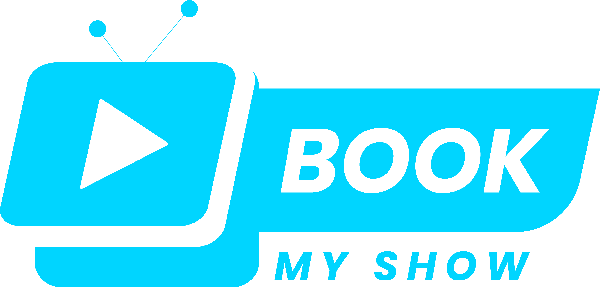

  
   

  <h3><b>Javascript Group Capstone</b></h3>

# 📗 Table of Contents

- [📖 About the Project](#about-project)
  - [🛠 Built With](#built-with)
    - [Key Features](#key-features)
  - [🚀 Live Demo](#live-demo)
- [💻 Getting Started](#getting-started)
  - [Prerequisites](#prerequisites)
  - [Setup](#setup)
  - [Install](#install)
  - [Usage](#usage)
  - [Run tests](#run-tests)
  - [Deployment](#deployment)
- [👥 Authors](#authors)
- [🔭 Future Features](#future-features)
- [🤝 Contributing](#contributing)
- [⭐️ Show your support](#support)
- [🙏 Acknowledgements](#acknowledgements)
- [❓ FAQ (OPTIONAL)](#faq)
- [📝 License](#license)

# 📖 Javascript Group Capstone 

**Javascript Group Capstone** is about building a web application based on an external API. We have selected an API that provides data about movie and series and then build the web app around it. The web app will have 2 or 3 user interfaces

## 🛠 Built With 
- HTML
- CSS
- Javascript
- Webpack
- Babel

### Key Features 

- **Movie like wishlist**
- **Comment thought for each movies**

(<a href="#readme-top">back to top</a>)

## 🚀 Live Demo 

- [Live Demo Link](https://rifat8080.github.io/Javascript-Group-Capstone/dist/index.html)

(<a href="#readme-top">back to top</a>)

## 💻 Getting Started 

To get a local copy up and running, follow these steps.

### Prerequisites

In order to run this project you need:

npm init -y

### Setup

Clone this repository to your desired folder:

git clone https://github.com/Rifat8080/Javascript-Group-Capstone.git

### Install

Install this project with:

npm install

### Usage

To run the project, execute the following command:

npm run build

### Run tests

To run tests, run the following command:

npm test

### Deployment

You can deploy this project using:

npm start

(<a href="#readme-top">back to top</a>)

## 👥 Authors 

👤 **Md Mahadi Hasan Rifat**

- GitHub: [@Rifat8080](https://github.com/Rifat8080)
- Twitter: [@mdmahadirifat98](https://twitter.com/mdmahadirifat98)
- LinkedIn: [md-mahadi-hasan-rifat-8b7851265](https://www.linkedin.com/in/md-mahadi-hasan-rifat-8b7851265/)

👤 **Author2**

- GitHub: [@githubhandle](https://github.com/githubhandle)
- Twitter: [@twitterhandle](https://twitter.com/twitterhandle)
- LinkedIn: [LinkedIn](https://linkedin.com/in/linkedinhandle)

(<a href="#readme-top">back to top</a>)

<!-- FUTURE FEATURES -->

## 🔭 Future Features 

> Describe 1 - 3 features you will add to the project.

- [ ] **[new_feature_1]**
- [ ] **[new_feature_2]**
- [ ] **[new_feature_3]**

(<a href="#readme-top">back to top</a>)

<!-- CONTRIBUTING -->

## 🤝 Contributing 

Contributions, issues, and feature requests are welcome!

Feel free to check the [issues page](https://github.com/Rifat8080/Javascript-Group-Capstone/issues).

(<a href="#readme-top">back to top</a>)

## ⭐️ Show your support 

> Write a message to encourage readers to support your project

If you like this project...

(<a href="#readme-top">back to top</a>)

## 🙏 Acknowledgments 

> Give credit to everyone who inspired your codebase.

I would like to thank...

(<a href="#readme-top">back to top</a>)

(<a href="#readme-top">back to top</a>)

## 📝 License 

This project is [MIT](./LICENSE) licensed.

